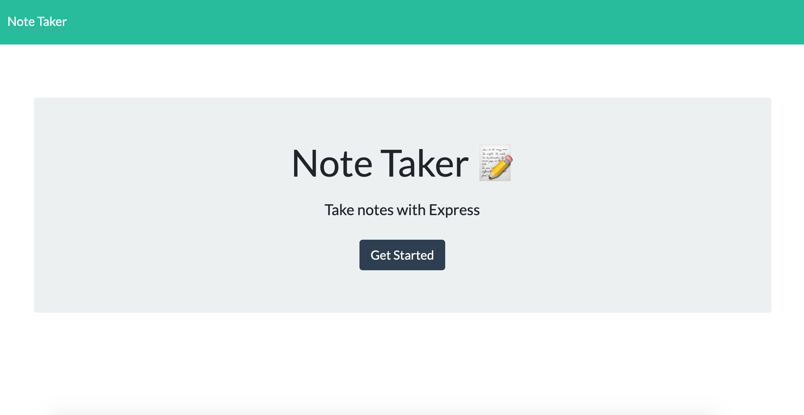
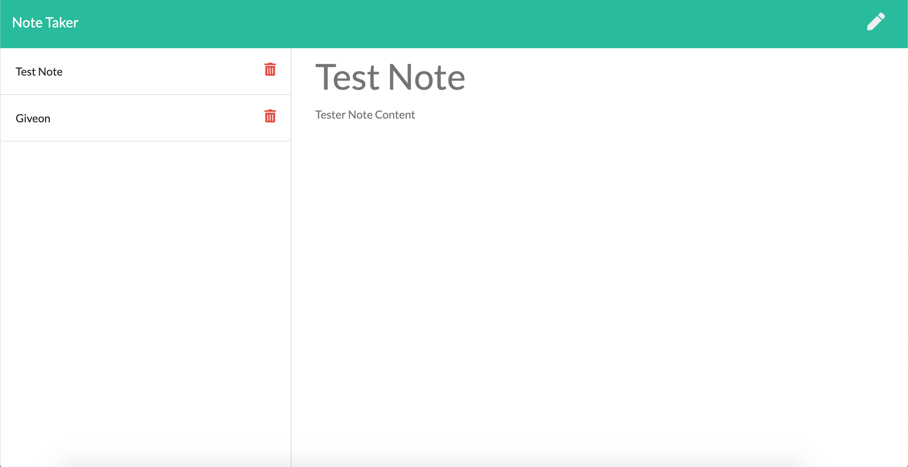

# NOTE TAKER

## Description

This application can be used to write, save and delete notes. The user can write any note with a title and content and can then save that note. That data will then persist even if the page is refresehd. The same is true if they choose to delete any given note.

## Table of Contents

* [Project Summary](#description)
* [Preview](#preview)
* [Deployed App](#app)
* [Contact Me](#questions)
  
## Preview

Below are some example images of the deployed app!

## App

Here is a link to the deployed app on Heroku: [Note Taker App](https://handy-note-taker.herokuapp.com/)

## Questions?

If you have any questions, please don't hesitate to reach out!

Github: [habby-bit](https://github.com/habby-bit)
  
Email: [habbyolu@gmail.com](habbyolu@gmail.com)
